# JAWS-UG 初心者支部 #31 監視編 サーバーのモニタリングの基本を学ぼう

## 概要
* <https://jawsug-bgnr.connpass.com/event/185492/?utm_campaign=event_waitlist_promotion_to_participant&utm_source=notifications&utm_medium=email&utm_content=detail_btn>
* （ハンズオン参加するのけっこうビビる派：「置いてかれたらやだなー」とか思う派なんですが、オンラインだし人多いし・・というわけで参加してみた。）
    * **実際こうやって時間をとって一連の簡単な操作をしてみる、というのは大事よな。**
    * **あと今回私は「手を動かすこと」に重点を置いてたので、会場の質問とかあんまりちゃんと追ってなかったのですが、他の参加者のブログとか読んでるとぱらぱら面白い小話されてたっぽくて、あああーーってなった。そっちまで気回せたら最高。**
* （VSCodeで画像を貼るやり方を覚えたのでここぞとばかりにスクショを貼っている）

---

## 監視編 サーバーのモニタリングの基本を学ぼう

* by AWSジャパン 内田大樹さん（ハンズオン進行：初心者支部 山本淳博さん）
* 手順 <https://www.slideshare.net/nikuyoshi/jawsug-31>

### 事前準備

* cFnでやる。増えてく増えてく
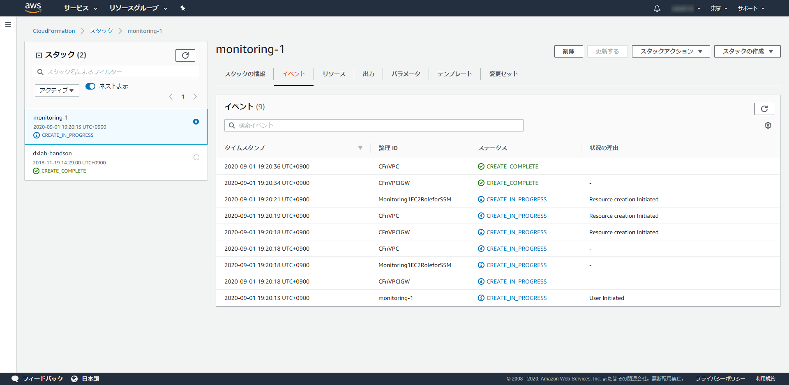
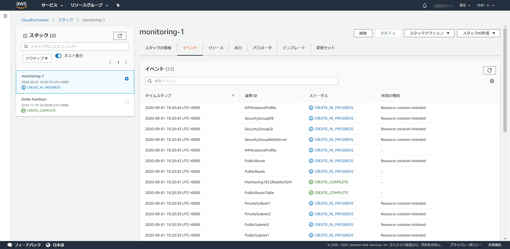
* まだ終わらない
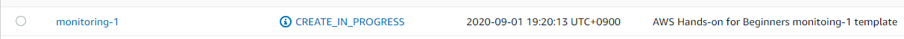
* あー終わった終わった
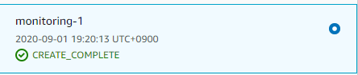
* >[September 1, 2020, 7:51 PM] : EC2WebServer02DNS に直接アクセスしても、ログイン後に01にリダイレクトされます
    * わたしも同じ状況ですが、これでいいみたいです。

### ハンズオン①EC2, ALB, RDSのメトリクス確認

* 各自作業してくれーな感じ。
* メトリクスを実際に指定してグラフを見てみよう！なコーナー。
* 「Cloudwatchの画面でUTCじゃなくて現地時間選べるようになったの最近だっけ？」
    * 「いや、割と前からあった気もする。」
    * >少なくともクラメソさんが2017年に記事書かれてました。
https://dev.classmethod.jp/articles/cloudwatch-change-time-format/

### ハンズオン②EC2のdisk 90%以上時のアラート発報

* メールアドレスconfirmまでやったよ
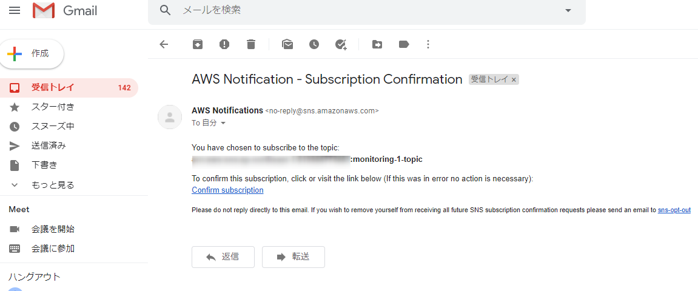
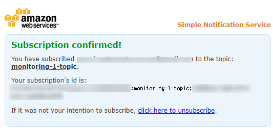
* （やってる途中で「全編おわった！」って人いて困惑した）
* わーきたきた
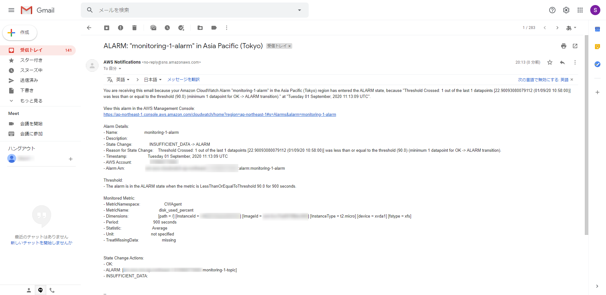

### ハンズオン③WordPressのアクセスログ、エラーログ確認

* わーすごい初めて見た
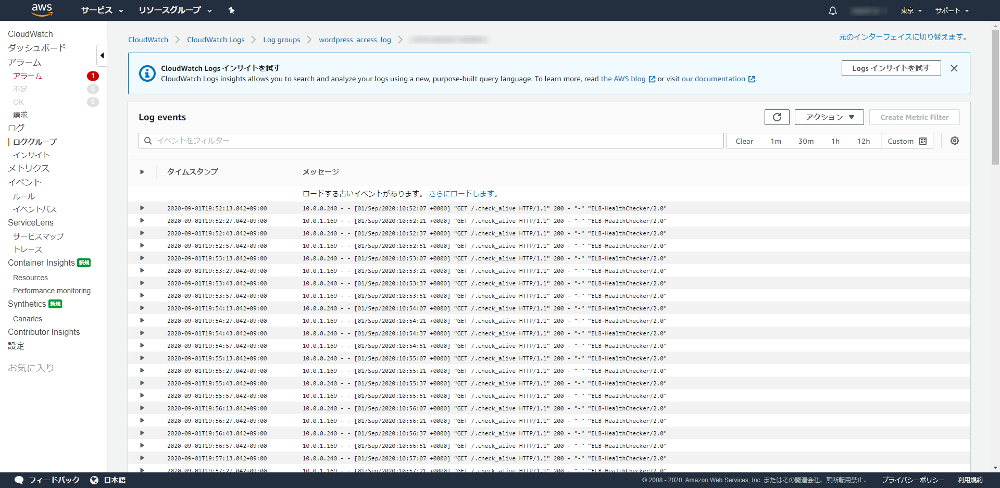
* 検索で大文字小文字は区別されるんですね
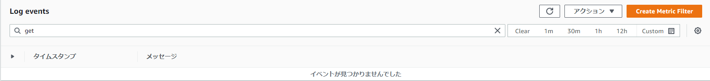

### まとめ、リソース削除

* おわった。オプションというか続きはこちら <https://pages.awscloud.com/JAPAN-event-OE-Hands-on-for-Beginners-monitoring-2020-reg-event-LP.html>

---

続きをやる。

### 続き④WordPressのアクセスログの分析

* わー見やすいすっごーい
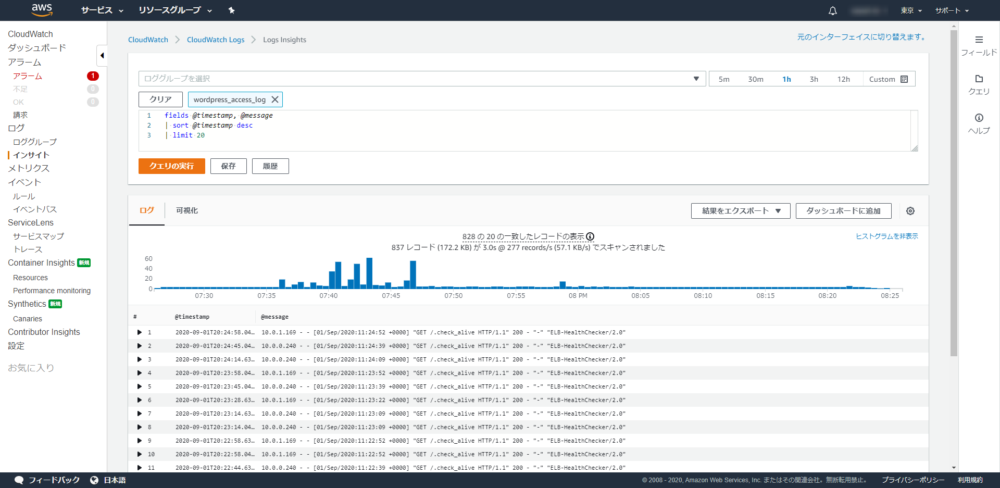
* てかクエリのヘルプ超便利じゃんすごい。多少の正規表現の書き方と少しの勘があればいじれるじゃんクエリ。
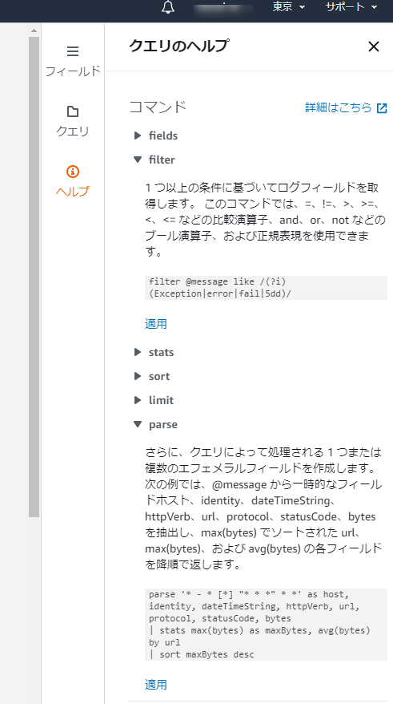

### 続き⑤WordPressの監視ダッシュボード作成

* たのしい。
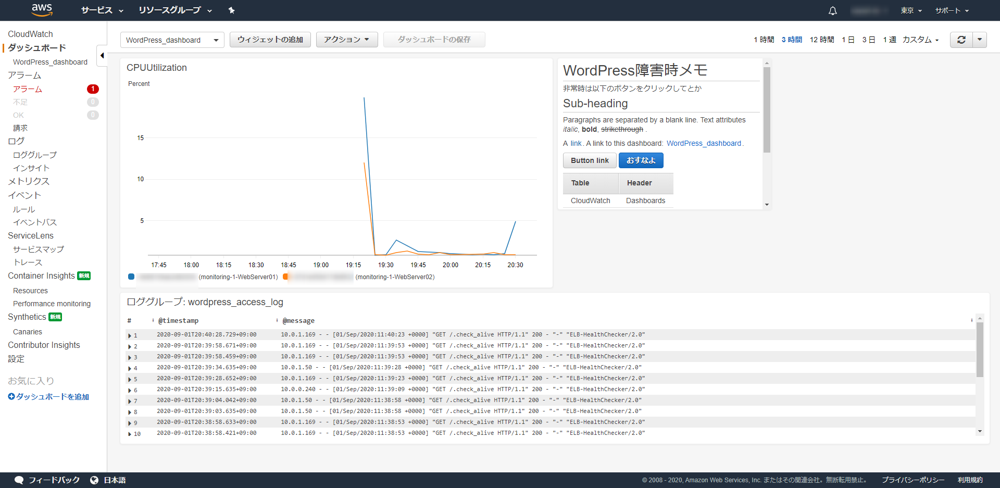

### 続き⑥EC2インスタンス停止時の通知

* わーい飛んできたよ。
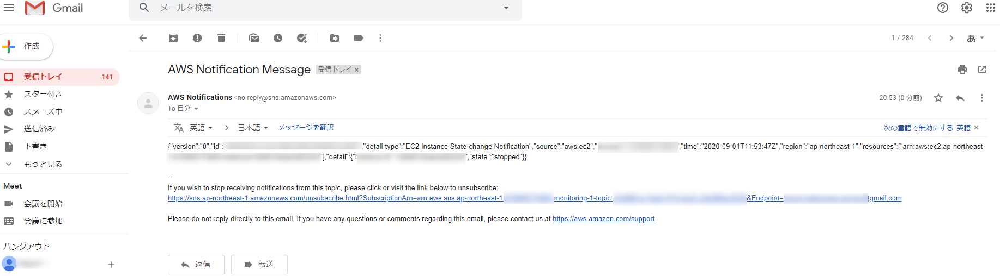