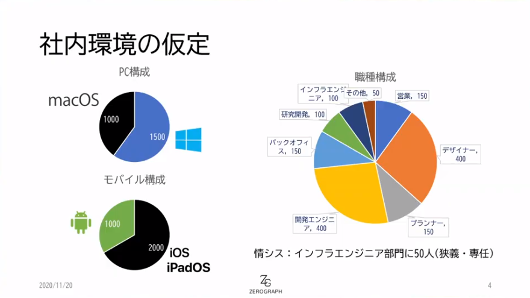
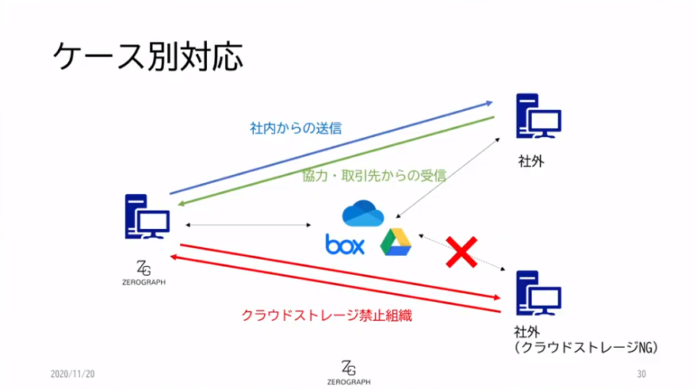
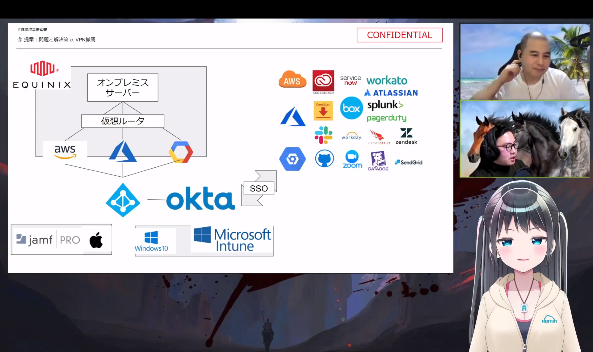

# LoI#3

## 概要

* <https://league-of-infosys.connpass.com/event/192913/>
* あれ？途中入室したら最初のひとり聞き逃した・・・・

---

# 2人目：khakさん

* 社内環境の仮定

* PPAP対策
    * ケース別の対応は必要になる　：暗号化zipファイルを受け取らないようにしましょう
    
        * 365のメールフロールールでブロック（社内からの送信）
        * Boxのファイルリクエスト機能（社外からの受信）
        * 無視（社外からの受信：クラウドストレージ禁止企業）
            * あどみんちゃん「これはやばくない？問い合わせくるよ？不動産銀行とか相手の人はつらいんじゃない？」
* キッティング効率化
    * ゼロタッチデプロイの実現
        * ABM, Jamf Connect, Intune, etc.
        * 足りないところはPowershellで補いましょう
    * あどみんちゃん「ゼロタッチ意外とできないときあるよ。できなかったときの工数が、ゼロタッチ実現して削減できる工数を大幅に超えちゃったらだめだからさ」
* VPN
    * データ保存場所を整理しましょう。そのために一旦、調べましょう。
        * Netskope for SaaS(CASB)
    * あとはサテライトオフィスの数を増やしてもいいんじゃないですかね。
* 年間総費用　：5000万プラス

---

# 3人目：ばるすさん

* 仮定
    * グループウェアはGoogleWorkspace
    * VPNはDC入口にある
* PPAP対策
    * 発生中のインシデントについては、わかる人に相談しましょう
        * クラウドネイティブさん呼んできましょう
        * 現状上手く回ってなさそうなので、分かる人を。という発想です。
    * 受信の禁止
        * Google Workspaceのコンテンツコンプライアンス機能
        * Boxのファイルリクエスト機能
    * 送信の禁止
        * Google Workspaceのコンテンツコンプライアンス機能
        * Boxの共有リンク機能
    * あどみんちゃん「やっぱり”禁止”というアプローチは愚かなのよ：禁止するんだったらその代替案をちゃんと確保しておかないといけないよね」
* キッティング効率化
    * （聞き逃しちゃった）
* VPN
    * 撤廃　：AWS DX, GCP Shared VPC, ERを経由してDC内リソースにアクセスする方針
    * あどみんちゃん「これって結局パブリッククラウドにVPNサーバ立てただけでしょ？コスト増えてるし問題は解決してないのよ」
    * あどみんちゃん「デザインの現場で、秘匿な大きいデザインデータをオンプレに置くって話は全然あるのよ。そういうのを下手にクラウドに置こうとすると、outboundの通信費が嵩んだりしちゃうのよ。オンプレVPNでアクセスさせてるのは理由があるのよ。」
* Tobe構成
