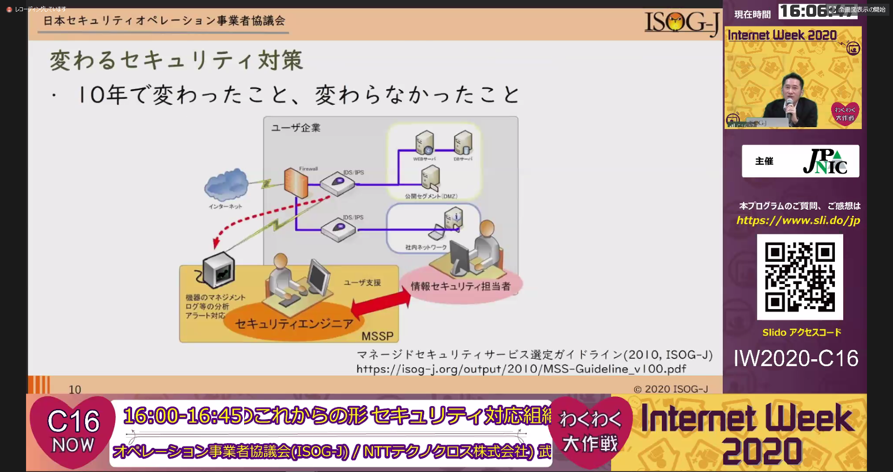
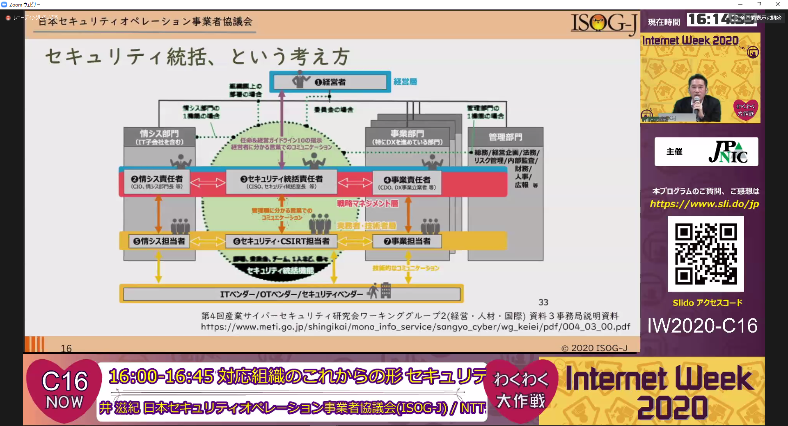

# Internet Week 2020(day1/2020-11-24)

## 概要

* <https://www.nic.ad.jp/iw2020/program/>
* 途中参加、きけるときにきけるものをきくスタンス

---

## C15 リモートワークを支える社内セキュリティ基盤の作り方

* by 水谷 正慶(クックパッド株式会社)
* （ぶっちゃけ自分の中でそんなに新しい話ないな・・・）（養老さん達と一緒にやってるのもあって、自然とこの話っぽい考え方を取り入れてやってるんだよなあ・・素晴らしいなあ・・・）

---

## C16 セキュリティ対応組織のこれからの形

* by 武井 滋紀(日本セキュリティオペレーション事業者協議会(ISOG-J) / NTTテクノクロス株式会社)
* （まじめにきこう。）
* ISOG-Jの活動のおはなし　：SOCやCSIRTが何をやっていくべきかなどを話しています cf. <https://isog-j.org/output/2017/Textbook_soc-csirt_v2.html>
* 「セキュリティをとりまく状況は、この10年で色々変わりましたよね／変わらなかったですよね」
    * 
    * やっぱり「インシデントが起きるとビジネスにより大きな影響を及ぼすようになってきた」のが多いですよね
        * 「セキュリティエンジニア」だけが考えていればいい話ではなく、いろんな部門のいろんなエンジニアが絡む必要が出てきた
        * 「そのために、”セキュリティ統括”という部門横断的な機能が必要になってきたんじゃないでしょうか？」
        
    * たとえば、このコロナでのテレワークの準備のときに対策や手順の話をいきなりしてなかったですか？（**「何を守るべきか／ビジネス上のリスクは何か」を考えていましたか？**）
        * （幸い弊社はこのあたり前からそこそこ整ってたので、パートナーさんまわりとか顧客対応だけで済んでた印象）
        * cf. <https://www.ipa.go.jp/security/keihatsu/sme/guideline/>
* 「チームに名前をつけることが大事なのではなく、何をするかを明確に決めることが大事ですよ」
    * 「どんな機能・役割が必要か」「そのためにどんな人が必要か」を考える必要がありますよと。 cf. <https://www.nca.gr.jp/activity/imgs/recruit-hr20170313.pdf>
        * （↑見ると必要なスキルめちゃくちゃある）
    * 機能を決めたうえで、自組織のなかで人材をどのように配置したらいいかを決める必要がありますよと。 cf. <https://www.meti.go.jp/press/2020/09/20200930004/20200930004-1.pdf>
        * （わたしみたいな小娘より役職各位がよくご認識いただくべき内容な気が）
    * ★今回紹介されたドキュメントとか読んで、「じゃあ弊社のCSIRTは今後どうなっていくと幸せか？」をじっくり考えてみたいかも。
    * 「そのうえで、このセキュリティ対応チームがどうなっていくべきかを考えたらいいとおもいます。」
* CSIRT Teamsに放流したひとりごと
> 「セキュリティ人材」、めちゃめちゃいろんな役割あるこれは驚いた
https://www.nca.gr.jp/activity/imgs/recruit-hr20170313.pdf