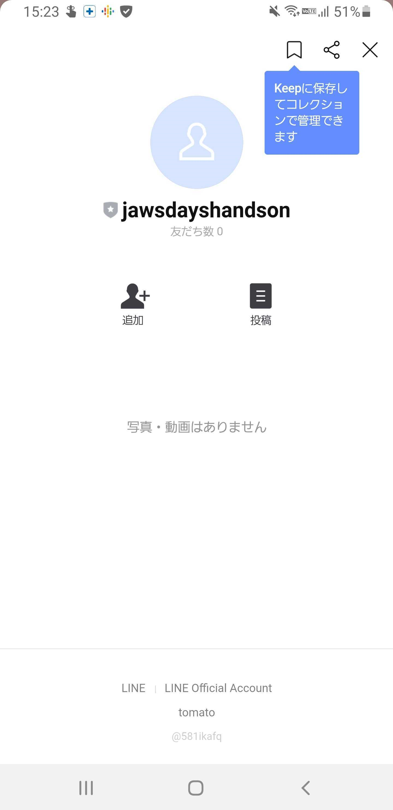
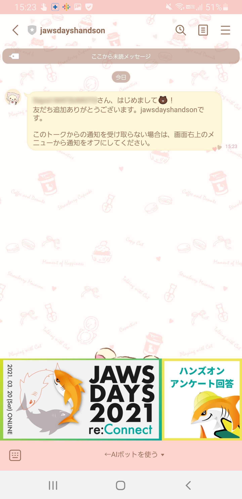
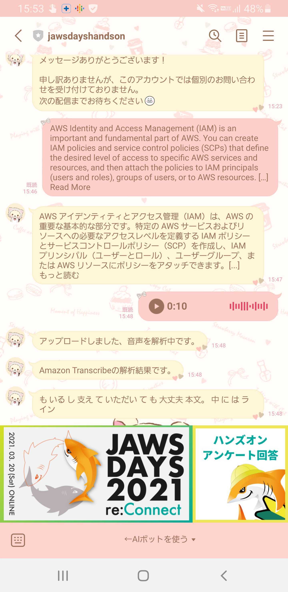

# はじめてのサーバーレス～翻訳APIを作ってみよう～

* 手順に従って最後までスルっと。
* おまけでこっちを後日やってみる <https://pages.awscloud.com/event_JAPAN_Hands-on-for-Beginners-Serverless-2019_LP.html?trk=aws_introduction_page>

---

# AWSとLINEをつないでAIボットを作ろう！初心者編

* すばらしい手順 <https://taketakekaho.github.io/aws-handson-nlp-linebot/#15>
* こんな感じにできてテンション上がる

* もっとなんか色々作ってみたさが出てきた。