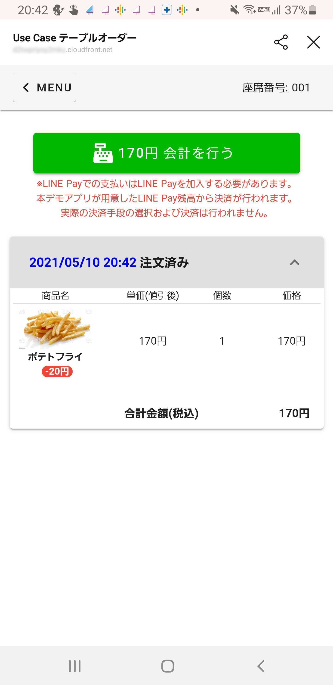

# 【LIFF/ミニアプリ】LINE×AWS×PayPayでテーブルオーダーを作ってみよう！ハンズオン[ LIFF / LINE API / 公式アカウント / PayPay / AWS ]

* これに沿ってやる。 <https://zenn.dev/mochan_tk/books/line-aws-paypay-handson-doc>

---

## Chapter 02:Messaging API チャネルの作成

### チャネル基本設定 <https://zenn.dev/mochan_tk/books/line-aws-paypay-handson-doc/viewer/3-create-line-login-channel#%E3%83%81%E3%83%A3%E3%83%8D%E3%83%AB%E5%9F%BA%E6%9C%AC%E8%A8%AD%E5%AE%9A>

* 英語表記にしてたから全然見つからなくて焦った


## Chapter 05:AWSの開発環境作成・準備（Cloud9）

### ディスク容量の拡張 <https://zenn.dev/mochan_tk/books/line-aws-paypay-handson-doc/viewer/5-setup-aws-cloud9>

* 領域名が違うみたい


## Chapter 06:バックエンドの構築手順

### Layerフォルダのリソースをデプロイ(共通処理) <https://zenn.dev/mochan_tk/books/line-aws-paypay-handson-doc/viewer/6-deploy-aws-backend#layer%E3%83%95%E3%82%A9%E3%83%AB%E3%83%80%E3%81%AE%E3%83%AA%E3%82%BD%E3%83%BC%E3%82%B9%E3%82%92%E3%83%87%E3%83%97%E3%83%AD%E3%82%A4(%E5%85%B1%E9%80%9A%E5%87%A6%E7%90%86)>

* samコマンドでなんか出てきた！あとで読む <https://docs.aws.amazon.com/serverless-application-model/latest/developerguide/serverless-sam-telemetry.html>
* 入力したらどどどっと。
```
******:~/environment/line-api-use-case-table-order/backend/Layer (master) $ sam deploy --guided

Configuring SAM deploy
======================

        Looking for config file [samconfig.toml] :  Found
        Reading default arguments  :  Success

        Setting default arguments for 'sam deploy'
        =========================================
        Stack Name [sam-app]: line-aws-paypay-layer-20210510
        AWS Region [ap-northeast-1]: ap-northeast-1
        Parameter Environment [dev]: dev
        #Shows you resources changes to be deployed and require a 'Y' to initiate deploy
        Confirm changes before deploy [y/N]: y
        #SAM needs permission to be able to create roles to connect to the resources in your template
        Allow SAM CLI IAM role creation [Y/n]: y
        Save arguments to configuration file [Y/n]: y
        SAM configuration file [samconfig.toml]: 
        SAM configuration environment [default]: 

        Looking for resources needed for deployment: Not found.
        Creating the required resources...
        Successfully created!

                Managed S3 bucket: aws-sam-cli-managed-default-samclisourcebucket-****
                A different default S3 bucket can be set in samconfig.toml

        Saved arguments to config file
        Running 'sam deploy' for future deployments will use the parameters saved above.
        The above parameters can be changed by modifying samconfig.toml
        Learn more about samconfig.toml syntax at 
        https://docs.aws.amazon.com/serverless-application-model/latest/developerguide/serverless-sam-cli-config.html

Uploading to line-aws-paypay-layer-20210510/****  1225992 / 1225992  (100.00%)

        Deploying with following values
        ===============================
        Stack name                   : line-aws-paypay-layer-20210510
        Region                       : ap-northeast-1
        Confirm changeset            : True
        Deployment s3 bucket         : aws-sam-cli-managed-default-samclisourcebucket-****
        Capabilities                 : ["CAPABILITY_IAM"]
        Parameter overrides          : {"Environment": "dev"}
        Signing Profiles             : {}

Initiating deployment
=====================
Uploading to line-aws-paypay-layer-20210510/****.template  1201 / 1201  (100.00%)

Waiting for changeset to be created..

CloudFormation stack changeset
-------------------------------------------------------------------------------------------------------------------------
Operation                      LogicalResourceId              ResourceType                   Replacement                  
-------------------------------------------------------------------------------------------------------------------------
+ Add                          UseCaseLayerDev****     AWS::Lambda::LayerVersion      N/A                          
-------------------------------------------------------------------------------------------------------------------------

Changeset created successfully. arn:aws:cloudformation:ap-northeast-1:****:changeSet/samcli-deploy****


Previewing CloudFormation changeset before deployment
======================================================
Deploy this changeset? [y/N]: y

2021-05-10 10:46:45 - Waiting for stack create/update to complete

CloudFormation events from changeset
-------------------------------------------------------------------------------------------------------------------------
ResourceStatus                 ResourceType                   LogicalResourceId              ResourceStatusReason         
-------------------------------------------------------------------------------------------------------------------------
CREATE_IN_PROGRESS             AWS::Lambda::LayerVersion      UseCaseLayerDev****     -                            
CREATE_COMPLETE                AWS::Lambda::LayerVersion      UseCaseLayerDev****     -                            
CREATE_IN_PROGRESS             AWS::Lambda::LayerVersion      UseCaseLayerDev****     Resource creation Initiated  
CREATE_COMPLETE                AWS::CloudFormation::Stack     line-aws-paypay-               -                            
                                                              layer-20210510                                              
-------------------------------------------------------------------------------------------------------------------------

CloudFormation outputs from deployed stack
---------------------------------------------------------------------------------------------------------------------------
Outputs                                                                                                                   
---------------------------------------------------------------------------------------------------------------------------
Key                 UseCaseLayerDev                                                                                       
Description         UseCaseLayerDev Layer ARN                                                                             
Value               arn:aws:lambda:ap-northeast-1:****:layer:LINE-USECASE-TABLEORDER-LAYER-DEV:1                  

Key                 UseCaseLayerName                                                                                      
Description         UseCaseLayerDev Layer Name                                                                            
Value               LINE-USECASE-TABLEORDER-LAYER-DEV                                                                     
---------------------------------------------------------------------------------------------------------------------------

Successfully created/updated stack - line-aws-paypay-layer-20210510 in ap-northeast-1
```
* できてる！


## Chapter 07:フロントエンド構築手順

### 本番（AWS）フロントエンド環境構築 <https://zenn.dev/mochan_tk/books/line-aws-paypay-handson-doc/viewer/7-deploy-aws-frontend#%E6%9C%AC%E7%95%AA%EF%BC%88aws%EF%BC%89%E3%83%95%E3%83%AD%E3%83%B3%E3%83%88%E3%82%A8%E3%83%B3%E3%83%89%E7%92%B0%E5%A2%83%E6%A7%8B%E7%AF%89>

* ふえてる


## Chapter 08:動作確認

* これはおもろい！
    * botちゃん
    
    
    * メニュー部分をタップすると初回なので求められる
    
    * いざアプリへ
    
    * 席番号を入力
    
    * ポテトたべたい
    
    * 注文してみる
    
    
    
    
    * 支払ってみる
    
    
    
    
    
    * 支払うと即メッセージがなにやら。
    
* たくさん注文してみた


---

paypayも個人である程度遊べるのねこれはおもろい。